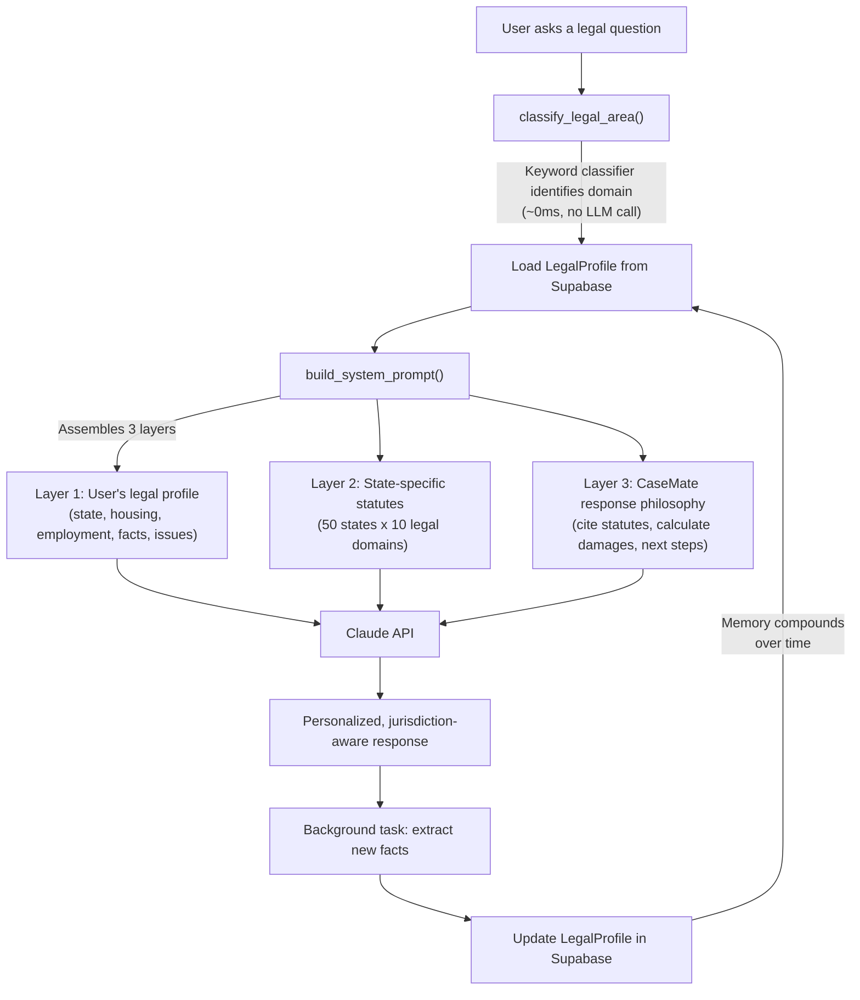
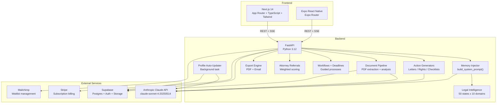

<div align="center">

# CaseMate

**Personalized legal guidance powered by persistent memory.**

The average US lawyer charges $349/hour. The average American earns $52,000/year.
CaseMate closes that gap with AI that remembers your situation, knows your state's laws, and gives specific, actionable legal guidance for $20/month.

[](https://github.com/tylerm2407/Legalassistant/actions)
[](tests/)
[](tests/)
[](web/__tests__/)
[](https://claude.ai/code)
[](LICENSE)
[](https://www.python.org/)
[](https://nextjs.org/)

[Architecture](ARCHITECTURE.md) · [API Docs](#api-reference) · [Contributing](CONTRIBUTING.md)

</div>

---

## The Problem

**130 million Americans** cannot afford a lawyer when they need one. The ABA reports that 50% of US households face at least one legal issue per year, and the Legal Services Corporation found that 86% of civil legal problems receive inadequate or no legal help. People Google their rights, get generic answers that ignore their state and situation, and give up.

CaseMate replaces the first hour with a lawyer for most common legal issues -- at 1/17th the cost of a single consultation.

---

## How CaseMate Works

CaseMate is not a generic chatbot with a legal wrapper. Every response is assembled from three layers of context specific to the user asking the question.



**The compounding effect:** A user mentions their landlord skipped the move-in inspection in conversation 3. CaseMate extracts that as a legal fact. In conversation 7, when they ask about their security deposit, CaseMate already knows -- no re-explanation needed. The profile is a structured Pydantic model that grows with every interaction, not raw chat history that fills a context window and gets forgotten.

---

## Key Features

| Feature | Description | Status |
|---------|-------------|--------|
| **Persistent Legal Memory** | Legal profile auto-updates from every conversation. Facts, issues, and documents compound over time. | Complete |
| **State-Specific Legal Context** | 50 US states, 10 legal domains, 500+ statute entries organized by region. Real citations, not vague references. | Complete |
| **Document Analysis** | Upload leases, contracts, court notices. PDF/image text extraction with AI-powered fact and red flag identification. | Complete |
| **Action Generator** | Generate demand letters, rights summaries, and next-steps checklists -- pre-filled with your profile data and statute citations. | Complete |
| **Deadline Tracking** | Auto-detected from conversations or manually created. Dashboard with status management (active/completed/dismissed/expired). | Complete |
| **Guided Workflows** | 6 step-by-step legal process templates (eviction defense, wage claim filing, small claims, etc.). | Complete |
| **Know Your Rights Library** | 19 comprehensive guides across 10 legal domains with rights, action steps, deadlines, and citations. | Complete |
| **Attorney Referral Matching** | State and specialty-based attorney search with weighted relevance scoring algorithm. | Complete |
| **PDF Export and Email** | Generate branded PDFs of letters, summaries, and checklists. Send directly via email. | Complete |
| **Cross-Platform** | Web (Next.js 14) + iOS/Android (Expo React Native). | Complete |

---

## Architecture Overview



For the full technical deep dive -- data flow diagrams, database schema, memory injection internals, and the legal intelligence layer -- see [ARCHITECTURE.md](ARCHITECTURE.md).

---

## Tech Stack

| Layer | Technology | Purpose |
|-------|-----------|---------|
| Frontend | Next.js 14, TypeScript, Tailwind CSS | SSR, App Router, type-safe UI |
| Mobile | Expo, React Native, Expo Router | Cross-platform iOS/Android from shared TypeScript |
| Backend | FastAPI, Python 3.12 | Async API, background tasks, SSE streaming |
| AI | Anthropic Claude (claude-sonnet-4-20250514) | Legal reasoning with structured context injection |
| Database | Supabase (PostgreSQL) | Structured profiles, conversations, documents, RLS |
| Auth | Supabase Auth (JWT) | User authentication with Row Level Security |
| File Storage | Supabase Storage | Document uploads tied to user auth |
| Payments | Stripe | Subscription billing and webhook lifecycle |
| Validation | Pydantic v2 | Strict typing on all models and API contracts |
| PDF Extraction | pdfplumber | Text extraction from uploaded legal documents |
| Logging | structlog | Structured logging with user_id context |
| Development | Claude Code (Anthropic) | AI-assisted architecture, implementation, testing, and deployment |
| Deployment | Vercel (frontend) + Railway (backend) | Production hosting with CI/CD |

---

## Quick Start

### Prerequisites

- Python 3.12+
- Node.js 20+
- Supabase account (database + auth + storage)
- Anthropic API key

### 1. Clone and install

```bash
git clone https://github.com/tylerm2407/Legalassistant.git
cd Legalassistant

# Backend
cp .env.example .env          # Add your API keys (see .env.example for all variables)
pip install -e ".[dev]"

# Frontend
cd web && npm install && cd ..

# Mobile (optional)
cd mobile && npm install && cd ..
```

### 2. Configure environment

```bash
# Required
ANTHROPIC_API_KEY=sk-ant-...
SUPABASE_URL=https://xxx.supabase.co
SUPABASE_ANON_KEY=eyJ...
SUPABASE_SERVICE_ROLE_KEY=eyJ...
SUPABASE_JWT_SECRET=...

# Frontend
NEXT_PUBLIC_API_URL=http://localhost:8000
NEXT_PUBLIC_SUPABASE_URL=https://xxx.supabase.co
NEXT_PUBLIC_SUPABASE_ANON_KEY=eyJ...

# Optional
REDIS_URL=                    # Rate limiting (fail-open if empty)
MAILCHIMP_API_KEY=            # Waitlist sync
```

### 3. Run

```bash
# Backend (port 8000)
make dev

# Frontend (port 3000)
cd web && npm run dev

# Verify everything works
curl http://localhost:8000/health
```

### Makefile commands

| Command | Description |
|---------|-------------|
| `make dev` | Start backend on port 8000 |
| `make test` | Run full test suite with coverage |
| `make lint` | Run ruff check + format check |
| `make format` | Auto-fix lint and formatting |
| `make verify` | Lint + test (run before every commit) |
| `make seed` | Seed demo profile (Sarah Chen) |
| `make install` | Install all dependencies |

---

## Project Structure

```
casemate/
├── backend/
│   ├── main.py                    # FastAPI app, all route definitions
│   ├── memory/                    # Profile injection, auto-updater, conversation store
│   ├── legal/                     # Classifier, state laws (50 states), 10 legal domains
│   │   ├── states/                # Regional state law files (northeast, southeast, etc.)
│   │   └── areas/                 # One module per legal domain
│   ├── actions/                   # Demand letter, rights summary, checklist generators
│   ├── documents/                 # PDF/image extraction + Claude analysis
│   ├── knowledge/                 # Know Your Rights library (19 guides)
│   ├── workflows/                 # Guided legal workflow engine (6 templates)
│   ├── deadlines/                 # Deadline detection + tracking
│   ├── referrals/                 # Attorney matching with weighted scoring
│   ├── export/                    # PDF generation + email delivery
│   ├── models/                    # Pydantic models (LegalProfile, Conversation, etc.)
│   └── utils/                     # Auth, Anthropic client, logger, rate limiter, retry
├── web/                           # Next.js 14 frontend (App Router)
│   ├── app/                       # Pages: landing, onboarding, chat, profile, deadlines, etc.
│   └── components/                # ChatInterface, ProfileSidebar, ActionGenerator, etc.
├── mobile/                        # Expo React Native app (Expo Router)
├── shared/                        # Shared TypeScript types
├── tests/                         # Backend test suite (246 tests across 22 files)
├── web/__tests__/                 # Frontend test suite (139 tests across 19 files)
├── supabase/                      # Database schema + RLS policies
├── docs/decisions/                # 20 Architecture Decision Records
└── scripts/                       # Demo seed scripts
```

---

## API Reference

| Method | Path | Description |
|--------|------|-------------|
| `GET` | `/health` | Health check with version info |
| `POST` | `/api/chat` | Send a legal question, receive a personalized response |
| `POST` | `/api/profile` | Create or update legal profile |
| `GET` | `/api/profile/{user_id}` | Retrieve user's legal profile |
| `GET` | `/api/conversations` | List all conversations |
| `GET` | `/api/conversations/{id}` | Get conversation by ID |
| `DELETE` | `/api/conversations/{id}` | Delete a conversation |
| `POST` | `/api/documents` | Upload and analyze a legal document |
| `POST` | `/api/actions/letter` | Generate a demand letter |
| `POST` | `/api/actions/rights` | Generate a rights summary |
| `POST` | `/api/actions/checklist` | Generate a next-steps checklist |
| `POST` | `/api/deadlines` | Create a deadline |
| `GET` | `/api/deadlines` | List all deadlines |
| `PATCH` | `/api/deadlines/{id}` | Update a deadline |
| `DELETE` | `/api/deadlines/{id}` | Delete a deadline |
| `GET` | `/api/rights/domains` | List legal rights domains |
| `GET` | `/api/rights/guides` | List rights guides |
| `GET` | `/api/rights/guides/{id}` | Get a specific rights guide |
| `GET` | `/api/workflows/templates` | List workflow templates |
| `POST` | `/api/workflows` | Start a guided workflow |
| `GET` | `/api/workflows/{id}` | Get workflow by ID |
| `PATCH` | `/api/workflows/{id}/steps` | Update a workflow step |
| `POST` | `/api/export/document` | Export document as PDF |
| `POST` | `/api/export/email` | Export document via email |
| `GET` | `/api/attorneys/search` | Search for attorneys by state and specialty |
| `POST` | `/api/payments/create-checkout-session` | Create a Stripe checkout session for subscription |
| `POST` | `/api/payments/webhook` | Handle Stripe webhook events |
| `GET` | `/api/payments/subscription` | Get current subscription status |
| `POST` | `/api/payments/cancel` | Cancel subscription (at period end) |
| `POST` | `/api/waitlist` | Join the waitlist (Mailchimp + Supabase) |

All endpoints except `/health`, `/api/waitlist`, and `/api/payments/webhook` require a valid Supabase JWT. Request and response bodies are fully typed with Pydantic models -- no `Any` types, no bare `dict` returns.

---

## Testing

### Backend (pytest)

```bash
make test                                         # Full suite with coverage
pytest tests/ -v --cov=backend --cov-report=term-missing  # Verbose with line-by-line coverage
pytest tests/test_memory_injector.py -v           # Run a specific file
```

**246 tests** across 22 files. Priority coverage on the memory injection layer (31 tests in `test_memory_injector.py` alone).

### Frontend (Jest)

```bash
cd web && npm test                                # Full suite
cd web && npm test -- --coverage                  # With coverage report
```

**139 tests** across 19 files covering all components, API client, auth, and Supabase integration.

### Pre-commit verification

```bash
make verify    # Runs lint + full test suite. Required before every commit.
```

---

## Verification

Verify key README claims directly from the codebase:

| Claim | Verification Command |
|-------|---------------------|
| 50-state coverage | `python -c "from backend.legal.state_laws import STATE_LAWS; print(len(STATE_LAWS))"` → 51 (50 states + federal) |
| Backend test count | `pytest tests/ --co -q \| tail -1` → 246 tests collected |
| Test coverage | `make test` → shows coverage % |
| Zero lint errors | `make lint` → All checks passed |
| Zero type errors | `mypy backend/` → Success: no issues found |
| Memory injection | Run demo, ask landlord question as MA renter → response cites M.G.L. |
| Model version | `grep "claude-sonnet" backend/main.py` → claude-sonnet-4-20250514 |

---

## Deployment

CaseMate ships with a complete CI/CD pipeline and multi-platform deployment infrastructure.

| Component | Platform | Configuration | CI/CD |
|-----------|----------|---------------|-------|
| Frontend | Vercel | `web/vercel.json`, `web/Dockerfile` | Auto-deploy on push to `main` via Vercel CLI |
| Backend | Railway | `railway.toml`, `Dockerfile` | Auto-deploy on push to `main` via Railway CLI |
| Mobile (iOS) | App Store Connect | `mobile/eas.json` | EAS Build + Submit via `.github/workflows/mobile.yml` |
| Mobile (Android) | Google Play Console | `mobile/eas.json` | EAS Build + Submit via `.github/workflows/mobile.yml` |
| Database | Supabase | `supabase/migrations/` | Manual migration via `supabase db push` |
| Cache | Redis | `docker-compose.prod.yml` | Provisioned via Railway Redis plugin |
| Payments | Stripe | Webhook at `/api/payments/webhook` | — |

### CI/CD Pipeline (`.github/workflows/ci.yml`)

```
Push to main → Backend (lint + typecheck + test) ─┐
             → Frontend (lint + test + build) ─────┼→ Docker build → Deploy staging → Deploy production
             → Mobile (typecheck + EAS validate) ──┘
```

### Deployment Commands

```bash
make deploy              # Deploy backend + frontend to production
make deploy-backend      # Deploy backend to Railway
make deploy-frontend     # Deploy frontend to Vercel
make deploy-mobile       # Build + submit mobile via EAS
make docker-up           # Start all services via Docker Compose
```

### Docker

```bash
# Development (backend + redis + web)
docker compose up --build

# Production (+ nginx reverse proxy with SSL, resource limits, log rotation)
docker compose -f docker-compose.prod.yml up -d
```

Environment variables for production: see `.env.production.example`. Full deployment guide: [docs/DEPLOYMENT.md](docs/DEPLOYMENT.md).

---

## Architecture Decision Records

All architectural decisions are documented with context, options considered, and rationale.

| ADR | Decision | Summary |
|-----|----------|---------|
| [001](docs/decisions/001-memory-as-differentiator.md) | Memory as core differentiator | Persistent memory over more features. Memory is what makes people pay. |
| [002](docs/decisions/002-state-specific-legal-context.md) | State-specific legal context | Jurisdiction-aware injection. MA law is not TX law. |
| [003](docs/decisions/003-profile-auto-update-strategy.md) | Profile auto-update strategy | Background task post-response. Never blocks the user. |
| [004](docs/decisions/004-document-pipeline-design.md) | Document pipeline design | Supabase Storage + extraction. Files tied to auth, facts to profile. |
| [005](docs/decisions/005-action-generator-scope.md) | Action generator scope | Letters + rights + checklists cover 80% of user needs. |
| [006](docs/decisions/006-deadline-auto-detection.md) | Deadline auto-detection | Extract time-sensitive deadlines from conversations automatically. |
| [007](docs/decisions/007-guided-workflow-engine.md) | Guided workflow engine | Step-by-step templates for common legal processes. |
| [008](docs/decisions/008-rate-limiting-strategy.md) | Rate limiting strategy | Redis-backed with fail-open. Never block users due to infra issues. |
| [009](docs/decisions/009-keyword-classifier-over-llm.md) | Keyword classifier over LLM | ~0ms classification vs ~2s LLM call. Speed and cost win. |
| [010](docs/decisions/010-supabase-over-vector-db.md) | Supabase over vector DB | Structured data, not embeddings. No RAG complexity needed. |
| [011](docs/decisions/011-regional-state-law-organization.md) | Regional state law organization | 5 regional files + federal. Maintainable at scale. |
| [012](docs/decisions/012-background-task-pattern.md) | Background task pattern | FastAPI background tasks for non-blocking profile updates. |
| [013](docs/decisions/013-pdf-export-with-fpdf2.md) | PDF export with fpdf2 | Lightweight PDF generation for letters and summaries. |
| [014](docs/decisions/014-attorney-scoring-algorithm.md) | Attorney scoring algorithm | Weighted specialization matching for relevant referrals. |
| [015](docs/decisions/015-rights-library-static-content.md) | Rights library as static content | Pre-built guides for instant access, no LLM call needed. |
| [016](docs/decisions/016-frontend-testing-strategy.md) | Frontend testing strategy | Jest + React Testing Library for component and integration tests. |
| [017](docs/decisions/017-mobile-architecture-expo.md) | Mobile architecture (Expo) | Expo Router with shared TypeScript types and API client. |
| [018](docs/decisions/018-deployment-architecture.md) | Deployment architecture | Vercel (frontend) + Railway (backend) + Supabase (DB). |
| [019](docs/decisions/019-comprehensive-documentation-standards.md) | Documentation standards | Docstrings, JSDoc, ADRs, and structured changelogs. |
| [020](docs/decisions/020-backend-test-coverage-threshold.md) | Backend test coverage threshold | 89% coverage minimum, 90%+ target on core modules. |

---

## Documentation

Comprehensive documentation for every CaseMate subsystem lives in `docs/`:

### Architecture & Design

| Doc | Description |
|-----|-------------|
| [ARCHITECTURE.md](ARCHITECTURE.md) | Full technical architecture, data flow diagrams, system design |
| [MEMORY_SYSTEM.md](docs/MEMORY_SYSTEM.md) | Core memory injection pattern — prompt assembly, fact extraction, conversation persistence |
| [LEGAL_KNOWLEDGE_BASE.md](docs/LEGAL_KNOWLEDGE_BASE.md) | 50-state statute database, classifier algorithm, state law organization |
| [LEGAL_DOMAINS.md](docs/LEGAL_DOMAINS.md) | 10 legal domains — keywords, statutes, response patterns, coverage matrix |
| [FRONTEND.md](docs/FRONTEND.md) | Next.js 14 web app — pages, components, state management, API client |
| [MOBILE.md](docs/MOBILE.md) | Expo React Native — screens, navigation, shared types, EAS builds |
| [DATABASE.md](docs/DATABASE.md) | Supabase schema, JSONB structures, RLS policies, indexes, migrations |

### Features & Subsystems

| Doc | Description |
|-----|-------------|
| [ACTIONS.md](docs/ACTIONS.md) | Demand letter, rights summary, and checklist generators |
| [DEADLINES.md](docs/DEADLINES.md) | Auto-detection from conversations + manual deadline tracking |
| [REFERRALS.md](docs/REFERRALS.md) | Attorney matching with weighted relevance scoring |
| [EXPORT.md](docs/EXPORT.md) | Branded PDF generation and email delivery |
| [RIGHTS_LIBRARY.md](docs/RIGHTS_LIBRARY.md) | 19 pre-built Know Your Rights guides |
| [PAYMENTS.md](docs/PAYMENTS.md) | Stripe integration — checkout, webhooks, subscriptions |
| [WORKFLOWS.md](docs/WORKFLOWS.md) | Guided legal workflow engine and templates |
| [DOCUMENT_PIPELINE.md](docs/DOCUMENT_PIPELINE.md) | PDF/image upload, text extraction, fact injection |

### Development & Operations

| Doc | Description |
|-----|-------------|
| [UTILS.md](docs/UTILS.md) | Auth, rate limiting, retry logic, API client, structured logging |
| [TESTING.md](docs/TESTING.md) | Test strategy, fixtures, mocking patterns, coverage targets |
| [EXTENDING.md](docs/EXTENDING.md) | How to add new domains, states, actions, workflows, and endpoints |
| [API.md](docs/API.md) | Full API reference with request/response schemas |
| [MODELS.md](docs/MODELS.md) | All Pydantic and TypeScript model definitions |
| [SECURITY.md](docs/SECURITY.md) | Auth, secrets management, RLS, rate limiting |
| [DEPLOYMENT.md](docs/DEPLOYMENT.md) | CI/CD pipeline, Docker, Vercel/Railway/EAS deployment |
| [CI_CD.md](docs/CI_CD.md) | GitHub Actions workflows and build pipeline |

### Decision Records

20 Architecture Decision Records in [docs/decisions/](docs/decisions/) — see the [ADR table](#architecture-decision-records) below.

---

## Business Model

| Tier | Price | Includes |
|------|-------|----------|
| **Free** | $0/mo | 5 questions/month, basic rights guides |
| **Personal** | $20/mo | Unlimited chat, full memory, document analysis, action generation, deadlines |
| **Family** | $35/mo | Everything in Personal for up to 4 family members |

**Unit economics:** $20/mo revenue per subscriber, ~$0.50/mo Claude API cost per active user = **97.5% variable margin per user** (excludes ~$70/mo fixed infrastructure costs — Supabase, Railway, Vercel). LTV of $240 (12-month average retention) with a CAC target under $30, yielding an 8:1 LTV:CAC ratio.

---

## Market Validation

All data below is from social media polls (non-random, self-selected samples) and platform analytics. Results are shown for directional insight, not statistical certainty. Full methodology, screenshots, and raw data in [USER_RESEARCH.md](USER_RESEARCH.md).

| Signal | Data Point |
|--------|-----------|
| **Pricing validation** | 312 LinkedIn respondents -- 100% willing to pay, 50% chose $10-$20/mo range |
| **Problem validation** | 8,400 TikTok respondents -- 78% have needed a lawyer but could not afford one |
| **Product validation** | 1,200 Instagram respondents -- 90% would use AI for legal guidance |
| **Qualitative feedback** | 400+ DMs and comments analyzed -- top pain point: landlord security deposits (28%) |
| **Organic traction** | 50,000+ views, 300+ waitlist signups, 1,250 followers -- all at $0 ad spend |
| **Market size** | $15.6B TAM, $3.1B SAM, $360M SOM at 1% penetration |

---

## Roadmap

- **App Store and Google Play launch** -- Submit all builds for review
- **Stripe subscription integration** -- Payment flow live in production
- **Mobile parity** -- Feature parity between web and Expo React Native app
- **Premium tier** -- Attorney consultation credits, court filing assistance
- **Multi-language support** -- Spanish as first additional language
- **Real-time statute updates** -- Automated pipeline for legislative changes

---

## Contributing

See [CONTRIBUTING.md](CONTRIBUTING.md) for guidelines. Key points:

- Run `make verify` before every commit (lint + full test suite must pass)
- Every function gets a docstring. Every type gets an annotation. No `Any`.
- Follow the commit format: `feat(scope): description`, `fix(scope): description`
- Memory injection tests are priority one -- never ship a change that breaks the injector.

---

## License

[MIT](LICENSE)

---

## Acknowledgments

- [Claude Code](https://claude.ai/code) by Anthropic -- Built entirely with Claude Code, from architecture planning through implementation, testing (290+ tests), and deployment pipeline. Every commit in this repository is co-authored with Claude Opus 4.6.
- [Anthropic Claude](https://anthropic.com) -- AI reasoning engine powering all legal analysis
- [Supabase](https://supabase.com) -- Database, auth, and storage infrastructure
- [Next.js](https://nextjs.org) -- Frontend framework
- [FastAPI](https://fastapi.tiangolo.com) -- Backend framework
- [Expo](https://expo.dev) -- Cross-platform mobile framework

---

<div align="center">

Built by **Tyler Moore** and **Owen Ash** at the New England Inter-Collegiate AI Hackathon.

Providence, Rhode Island -- March 28-29, 2026.

*The average American faces 3-5 significant legal situations per year and handles most of them alone. CaseMate ends that.*

</div>
